# Klavyl handwired mechanical keyboard

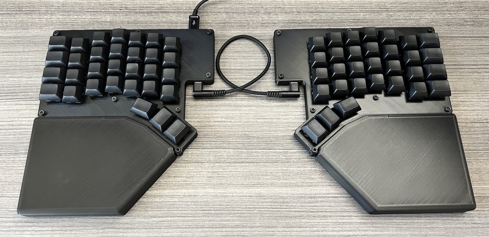

**Klavyl** is a [Klavgen](https://github.com/klavgen/klavgen)-based, handwired, hotswappable, split, ortholinear,
3D-printed, highly composable mechanical keyboard that has 4 rows and 7 columns, a 3-key thumb fan, is easy to solder,
is low height, and has a palm rest. That's a lot, so let's decompose:

- **handwired**: you don't need to buy or make PCBs
- **hotswappable**: uses MX switches with Kailh hotswap sockets
- **split**: left and right hand halves are separate
- **ortholinear**: keys form a line across rows, rather than staggered where each row is offset
- **3D-printed without supports** on a home FDM printer, with large parts kept simple to minimize the chance of errors
- **low height**: only 11 mm tall, including 2mm top and bottom plates
- **highly composable**: small changes to the layout only require printing a top plate since the switch holders can be
  moved and the wrapped wires can be unwrapped to allow keys to be spaced further apart
- **easy to solder**: uses holders for the Kailh hotswap sockets that allow in-place soldering of the Kailh socket,
  diode and wires; supports bare wires without insulation, because stripping wires is a pain
- **sturdy**: the Kailh socket holders support the top plate to prevent bending
- **4 rows and 7 columns, plus a 3-key thumb fan**: 31 keys per half, 62 total
- **parametrically generated with [Klavgen](https://github.com/klavgen/klavgen)**
- **palm rests**: detachable and optional

I made Klavyl as a personal modification of the excellent [Redox keyboard](https://github.com/mattdibi/redox-keyboard).

**Note:** Klavyl works but is still a work in progress.

The current files are meant for:

- Kailh hotswap sockets
- Pro Micro or similar boards of the same size
- TRRS connection between the two halves
- QMK for the firmware
- Printing on a reasonably tuned 3D printer. I used an Ender 3 V2.
- M3 screws with inserts that are melted into the board

If you want a different config, let me know by filing an issue.

# More pictures

Back photo, showing the low height of 11 mm and the cable connections:

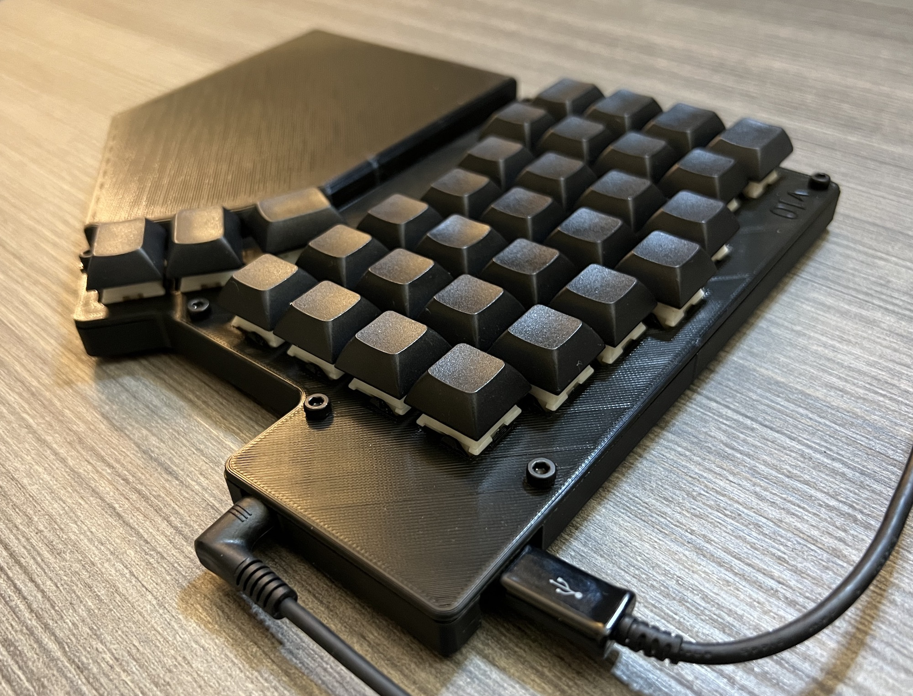

Front of 3D model, showing all the components (top, bottom, palm rest, switch holders, Pro Micro holder, TRRS jack
holder):

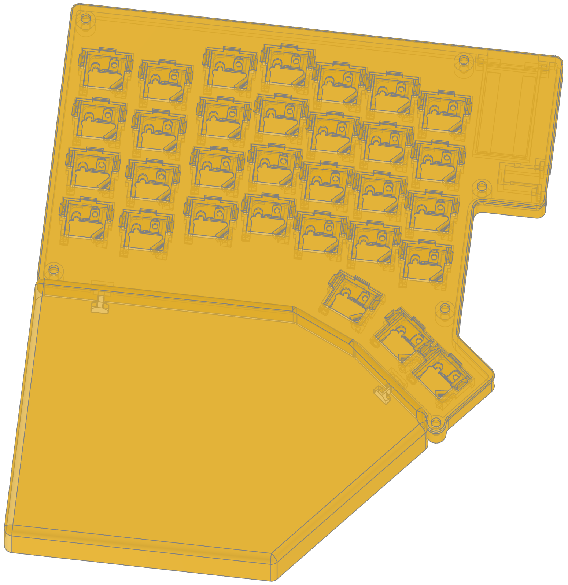

Back of 3D model, showing the cutouts for the Pro Micro and TRRS jack as well as all the components:

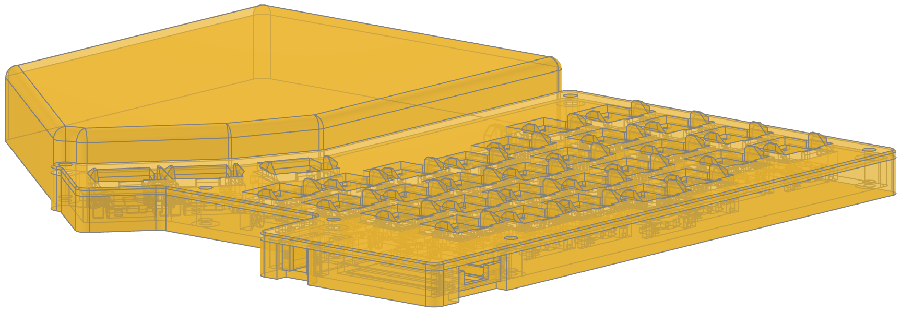

# Generating STLs and adjust the layout

To see how Klavyl is built and adjust it, as well as re-generate the output `.stl` files (from the `stl` directory),
check out and run the [`klavyl.py`](klavyl.py) file. It's still quite messy.

# Purchased parts

These are the parts you need. The Amazon links is what I used and they are non-affiliate.

| Quantity | Part                                  | Notes                                                                    |
| -------: | ------------------------------------- | ------------------------------------------------------------------------ |
|       62 | MX switches                           | I use Boba U4, from AliExpress                                           |
|       62 | MX keycaps                            | 48 1u keycaps and 14 1.25u keycaps                                       |
|       62 | Kailh hotswap sockets                 | [Amazon link](https://www.amazon.com/gp/product/B096WZ6TJ5)              |
|       62 | 1N4148 diodes                         | [Amazon link](https://www.amazon.com/gp/product/B06XB1R2NK)              |
|        2 | PJ-320A 4-pole 3.5 mm TRRS connectors | [Amazon link](https://www.amazon.com/gp/product/B07KY862P6)              |
|        2 | 4.7 kOhm resistors                    | [Amazon link](https://www.amazon.com/gp/product/B07HDFHPP3)              |
|        2 | Arduino Pro Micro microcontrollers    | [Amazon link](https://www.amazon.com/gp/product/B08BJNV1J3)              |
|        1 | TRRS cable                            | [Amazon link](https://www.amazon.com/gp/product/B07KY862P6)              |
|        1 | Micro USB cable                       | Make sure it's not a power-only cable                                    |
|  20 feet | 26 gauge or smaller solid core wire   | You can also use enameled or stranded wires, but it will be more painful |
|      ~20 | Rubber bumpers to stabilize the board | [Amazon link](https://www.amazon.com/gp/product/B08MDW52SC)              |
|       12 | M3 6 or 8 mm screws                   | [Amazon link](https://www.amazon.com/gp/product/B07VRC5RJ8)              |
|       12 | M3 inserts                            | [Amazon link](https://www.amazon.com/gp/product/B01IYWTCWW)              |
|     Much | PLA for 3D printing most parts        | I used a mix of Hatchbox and Overture, but any should do                 |
|     Some | ABS for 3D printing switch holders    | I used Hatchbox                                                          |

# Tools

You need:

- Soldering iron and everything around it: solder, safety glasses, ventilation, etc.
- Tweezers
- Wire stripper, unless you are going to strip manually or will use bare wire for the rows/columns and only use
  insulated wire for the Pro Micro and TRRS jacks

# 3D printed parts

All the parts for 3D printing are in the `stl` directory. They have been tested on an Ender 3 V2 and therefore the
tolerances may not work for your printer. If that's the case, let me know by filing an issue in the project.

You should be able to print everything in PLA, expect the switch holders for which I recommend ABS because you'll be
soldering on them and the soldering iron can very easily melt PLA.

This is what you should print:

| Quantity | File                    | Notes                                                                       |
| -------: | ----------------------- | --------------------------------------------------------------------------- |
|        1 | `keyboard top.stl`      | Print in normal orientation for the left hand                               |
|        1 | `keyboard top.stl`      | Print **mirrored** for right hand                                           |
|        1 | `keyboard bottom.stl`   | Print in normal orientation for the left hand                               |
|        1 | `keyboard bottom.stl`   | Print **mirrored** for right hand                                           |
|        1 | `palm rest.stl`         | Print in normal orientation for the left hand                               |
|        1 | `palm rest.stl`         | Print **mirrored** for right hand                                           |
|       62 | `switch holder.stl`     | Print file as is, without supports, with the flat side facing down. Use ABS |
|        4 | `connector.stl`         | Print file as is, without supports                                          |
|        2 | `controller holder.stl` | Ensure your Pro Micros actually fit                                         |
|        2 | `trrs jack holder.stl`  | Ensure your TRRS jacks actually fit                                         |

## Keyboard bottom

File [`keyboard_bottom.stl`](stl/keyboard_bottom.stl). The bottom part, for the left hand.

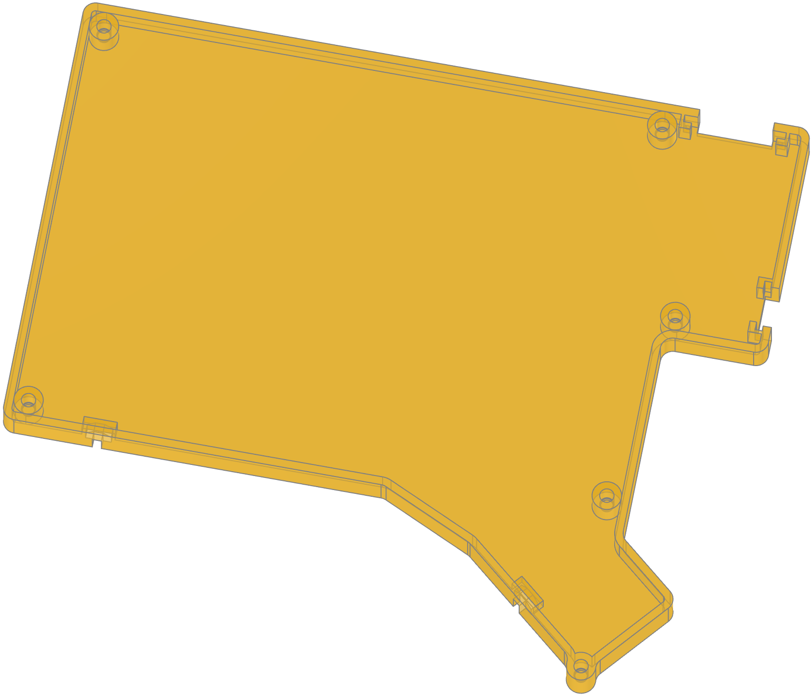

## Keyboard top

File [`keyboard_top.stl`](stl/keyboard_top.stl). The top plate, for the left hand. It is flat with simple holes so that
it can be made with a laser cutter or a CNC machine

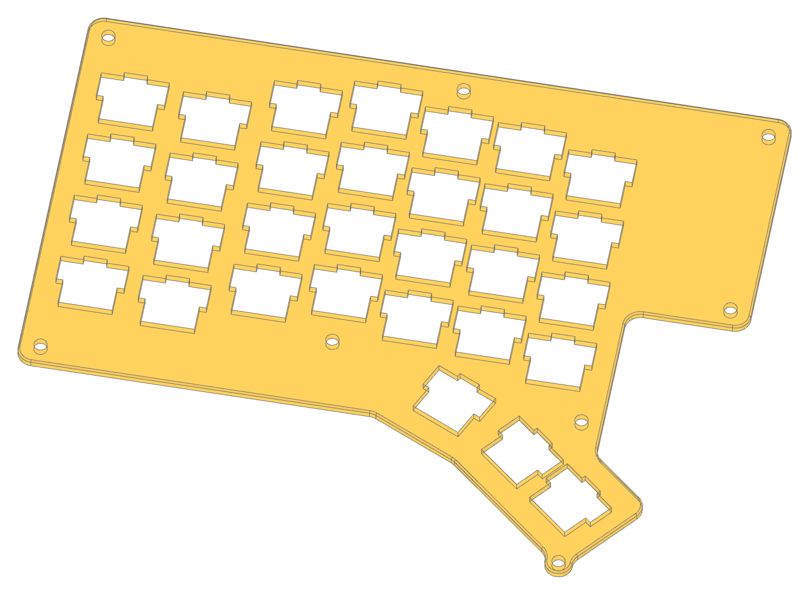

## Palm rest

File [`palm_rest.stl`](stl/palm_rest.stl). The palm rest which attaches to the bottom via connectors. It can also be
fused with the bottom, see below.

## Switch holder

File [`switch_holder.stl`](stl/switch_holder.stl). Holds the Kailh hotswap socket and allows you to solder the diode,
column and row wires in-place. Print it the way it's oriented in the STL, with the flat side (that has a small hole) on
the printing plate.

**Note**: print switch holders in ABS since you'll be soldering on them.

This is what the switch holder looks like when "positioned" into a single-key keyboard:

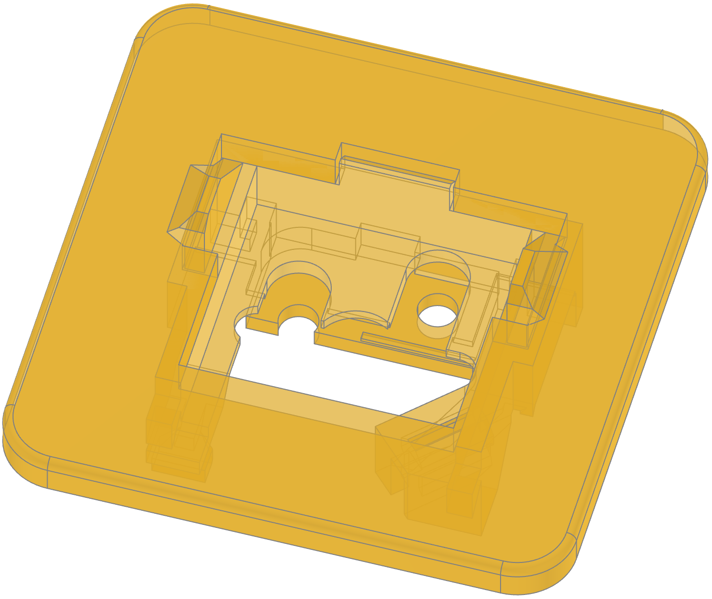
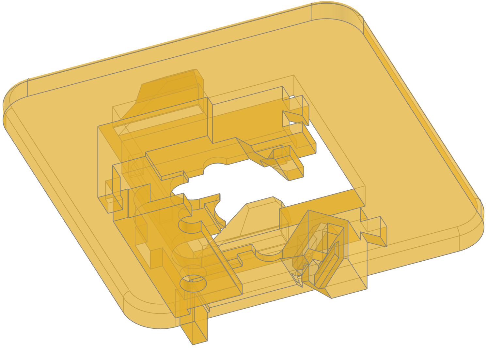

## Pro Micro controller holder

File [`controller_holder.stl`](stl/controller_holder.stl). Holds the Arduino Pro Micro controller.

## TRRS jack holder

File [`trrs_jack_holder.stl`](stl/trrs_jack_holder.stl). Holds the TRRS jack.

## Connector

File [`connector.stl`](stl/connector.stl). Connects the bottom to the palm rest.

# Building

## Build the left side

1. Strip wires completely for rows and columns, making sure they are about 2x the size of the plate due to wrapping. Do
   not leave insulated wire at the end like I did.

1. Row by row, insert the socket holders, and wrap the row wires:

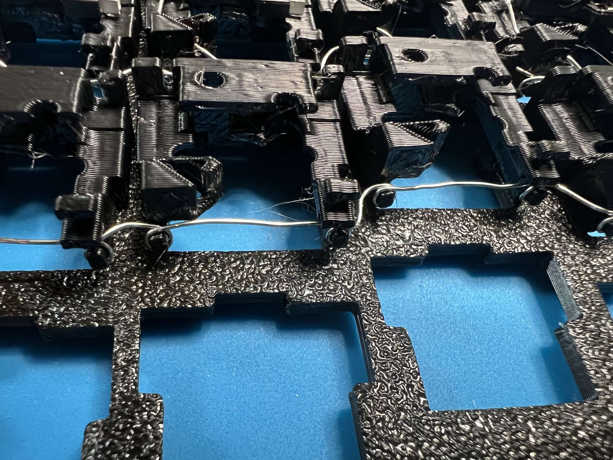

**Note**: the 3 keys on the thumb fan are a separate row

3. Place the diodes, bending the legs on the back to hold them in place:

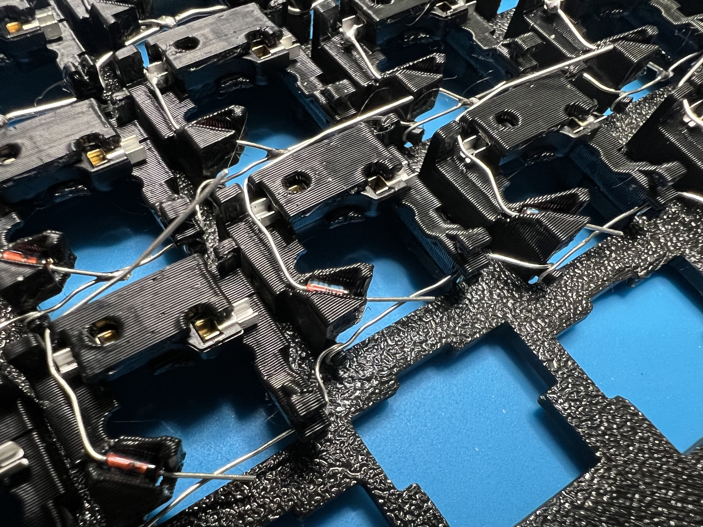

4. Solder the diodes and row wires, and cut the extra diode legs:

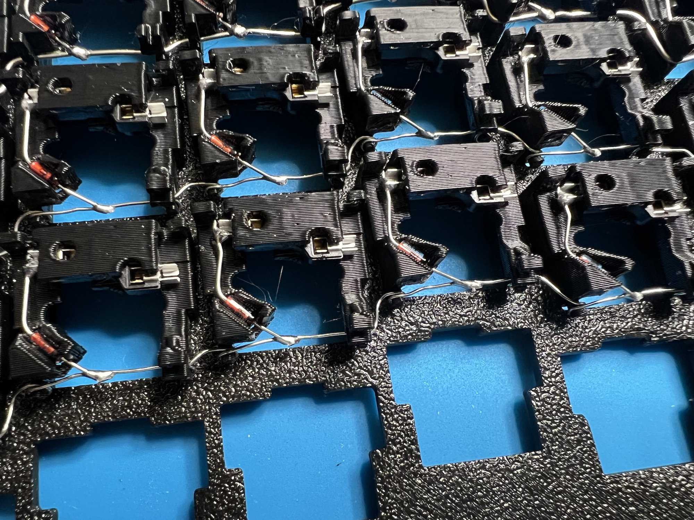

5. Wrap and solder the column wires. Note that you should not have the top and left dangling wires, as it's much better
   to first solder wires to the Pro Micro and then solder those wires to the rows/columns:

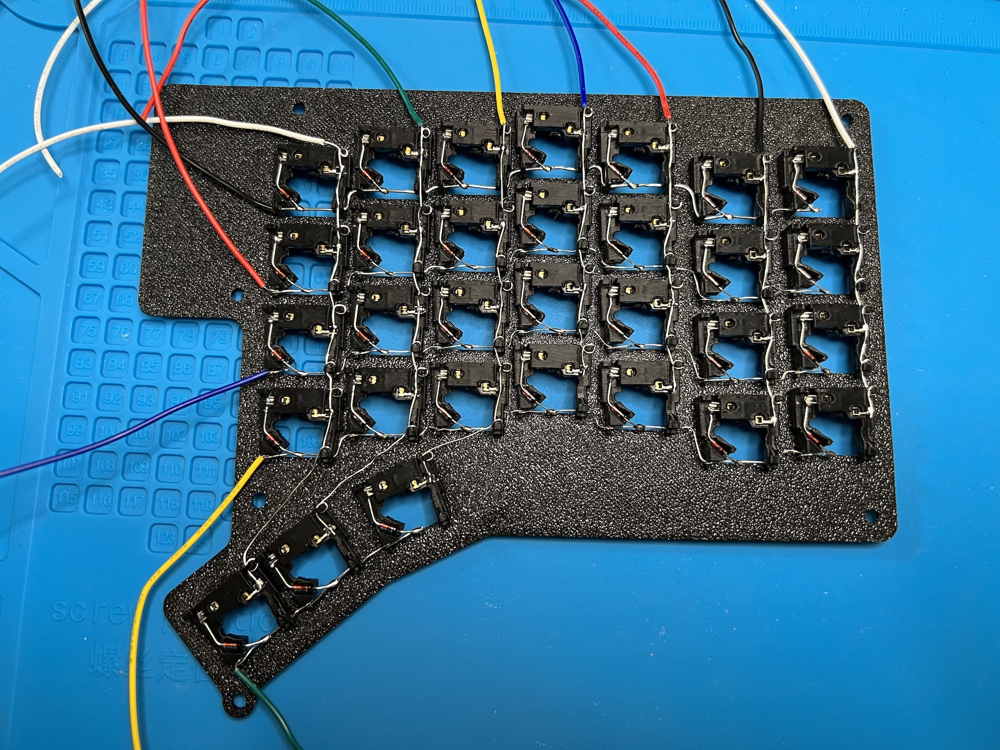

**Note**: the 3 keys on the thumb fan need to be wired to columns 5, 6, and 7 (see the picture).

6. Wire the TRRS jack to the Pro Micro. Klavyl uses the same wiring as
   [the Redox keyboard](https://github.com/mattdibi/redox-keyboard/blob/master/redox/pcb/Redox-schematic.pdf). If you
   orient the TRRS jack with the pins on top, and the jack front hole pointing to you, this is the scheme:

   - Left pin (should be the only one): VCC
   - Right front pin (close to you and the jack front hole): 3/PD0
   - Right middle pin: 2/PD1
   - Right back (closest to the left pin and farthest from you): GND

1. Solder TRRS jack resistors **ON ONE SIDE ONLY**. Solder two resistors, one between the 3/PD0 and VCC wires, and one
   between the 2/PD1 and VCC wires. This was pretty challenging to do given the short wires and limited spae. Use
   electrical tape to insulate the connections.

1. Solder long wires to the controller itself with the other ends dangling. See the next step for which holes on the Pro
   Micro to use. Don't do as in the picture above where I did the reverse and had the wires soldered to the rows/columns
   first.

1. Route the controller wires and solder them to the row and column wires. This is the trickiest part. Your result may
   look like this but it may be even better to route the wires between keys, rather than only on the top/side. Klavyl
   uses the same wiring as
   [the Redox keyboard](https://github.com/mattdibi/redox-keyboard/blob/master/redox/pcb/Redox-schematic.pdf). You have
   to solder the columns mirrored. On both sides, column 1 is the 4-row column that is farthest away from the thumb fan.
   Row 0 is always the top row. The wiring needs to be:

   - Column 1: A2/PF5
   - Column 2: A1/PF6
   - Column 3: A0/PF7
   - Column 4: 15/PB1
   - Column 5: 14/PB3
   - Column 6: 16/PB2
   - Column 7: 10/PB6
   - Row 1: 4/PD4
   - Row 2: 6/PD7
   - Row 3: 7/PE6
   - Row 4: 8/PB4
   - Row 5: 9/PB5

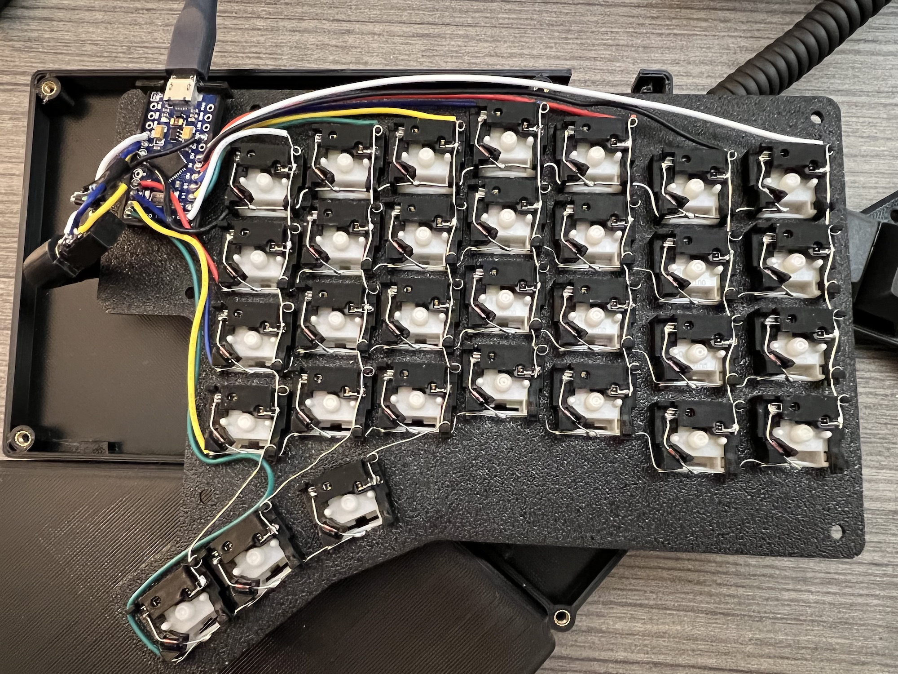

10. Use the soldering iron to melt the M3 inserts into the bottom. I used a temperature of 200-250 degrees F. See
    picture above.

## Build the right side

It's the same as the left, but mirrored. Watch out for having resistors only on one side.

# Flashing QMK

**Note**: the default layout is very custom to me. It is meant for a Mac and has a lot of unexpected changes including
swapping around shifted and unshifted keys. Make sure to modify it.

1. Grab a recent version of [QMK](https://github.com/qmk/qmk_firmware). I used commit
   [779c7debcfff1a4a3ad578a0c12bdd50cba11039](https://github.com/qmk/qmk_firmware/tree/779c7debcfff1a4a3ad578a0c12bdd50cba11039).
   Follow the QMK guide to get it set up and compiling.

1. Copy the `klavyl` dir from `qmk/keyboards` in this repo to the `keyboards` dir in QMK.

1. Add a new keymap or adjust the default layout to suit you.

1. Compile and flash with `make klavyl:default:avrdude` (replace `default` with your keymap if you made a custom one).
   You have to reset your Pro Micro to enter bootloader mode by shorting quickly once RST and GND.

Once you flash both halves the first time, later on you only need to flash the half that connects by USB to your
computer. The other half just reports what keys are pressed. Only the primary half decides what this means in terms of
symbols sent to the computer.
